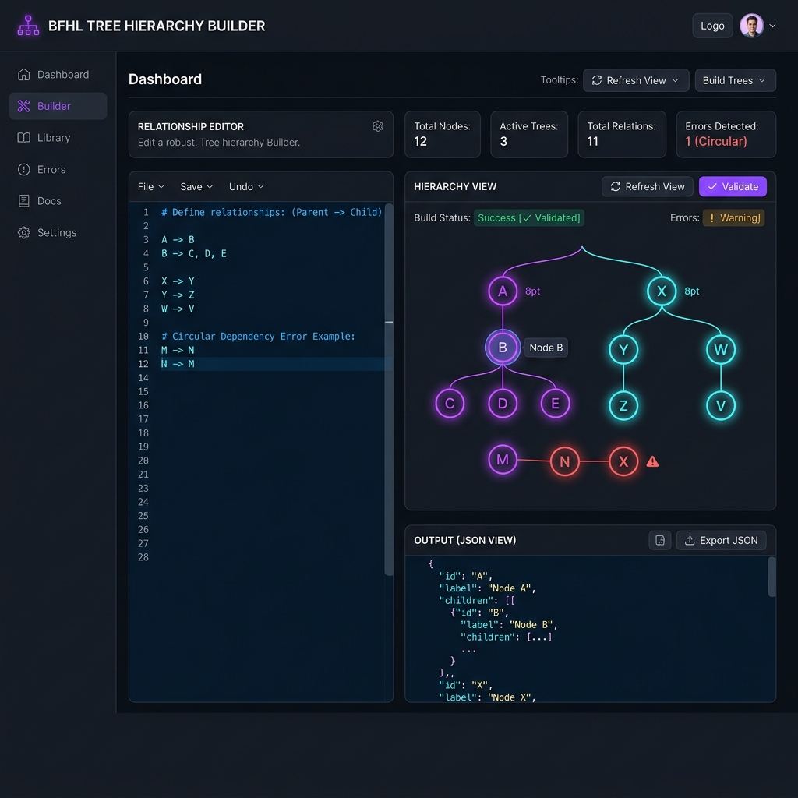

# BFHL Tree Hierarchy & Cycle Builder

A production-ready full-stack Next.js application designed to parse node connections, build independent tree hierarchies, handle edge validation rules, isolate duplicates, resolve multi-parent conflicts, and detect/visualize cycles.



---

## ⚡ Tech Stack & Architecture

- **Framework:** Next.js 15 (App Router)
- **Styling:** Tailwind CSS (Custom Dark Theme with dynamic ambient light effects & glassmorphism)
- **Language:** JavaScript (ES Modules)
- **State Management:** React Hook State
- **Deployment Platform:** Vercel

---

## 🛠️ API Documentation

### **POST `/api/bfhl`**

#### **Request Body**
```json
{
  "data": [
    "A->B",
    "A->C",
    "B->D",
    "C->E",
    "E->F",
    "X->Y",
    "Y->Z",
    "Z->X"
  ]
}
```

#### **Response Body (Rule-Conformant Format)**
```json
{
  "user_id": "eashita_24062026",
  "email_id": "eashita@college.edu",
  "college_roll_number": "26BCE1001",
  "hierarchies": [
    {
      "root": "A",
      "tree": {
        "A": {
          "B": {
            "D": {}
          },
          "C": {
            "E": {
              "F": {}
            }
          }
        }
      },
      "depth": 4
    },
    {
      "root": "X",
      "tree": {},
      "has_cycle": true
    }
  ],
  "invalid_entries": [],
  "duplicate_edges": [],
  "summary": {
    "total_trees": 1,
    "total_cycles": 1,
    "largest_tree_root": "A"
  }
}
```

---

## 🧭 Core Engine Processing Rules (All 10 Implemented)

1. **Format Validation:** Edge format must be `X->Y`, where `X` and `Y` are single uppercase English alphabetic characters (A-Z) and $X \neq Y$. Whitespace is trimmed first. Invalid formats are rejected and returned in `invalid_entries`.
2. **Deduplication:** Subsequent duplicate occurrences of an edge are logged exactly once in `duplicate_edges` and discarded.
3. **Multi-Parent Restriction:** A node can have at most one parent. If a child node already has a parent assigned, any later incoming parent edges are discarded.
4. **Tree Construction:** Groups nodes into weakly connected components, then constructs individual hierarchical trees.
5. **Pure Cycle Recovery:** If a connected component lacks a natural root (every node has an in-degree > 0), the component is a pure cycle. The lexicographically smallest node in that component is assigned as the root.
6. **Cycle Detection:** Pure cycles are flagged with `"has_cycle": true` and `"tree": {}`. No `"depth"` property is returned.
7. **Tree Generation Output:** Nested object structure representing relationships.
8. **Depth Calculation:** The length of the longest root-to-leaf path (number of nodes).
9. **Summary Statistics:** Output contains `total_trees`, `total_cycles`, and `largest_tree_root`.
10. **Largest Tree Selection:** The tree with the greatest depth is labeled as the largest tree root. Ties are broken lexicographically.

---

## 🚀 Local Development

1. **Install Dependencies:**
   ```bash
   npm install
   ```

2. **Run Tests:**
   ```bash
   npm test
   ```

3. **Run Dev Server:**
   ```bash
   npm run dev
   ```
   Open [http://localhost:3000](http://localhost:3000) to view the UI.

---

## 📦 Vercel Deployment Steps

1. **Install Vercel CLI** (Optional, or use GitHub Integration):
   ```bash
   npm install -g vercel
   ```

2. **Deploy via CLI:**
   From the root folder, run:
   ```bash
   vercel
   ```
   Follow the prompts to link/create the project.

3. **Promote to Production:**
   ```bash
   vercel --prod
   ```

Alternatively, push this repository to GitHub, go to [Vercel Dashboard](https://vercel.com), click **"Add New"** -> **"Project"**, import the repository, and click **"Deploy"**. The build settings are auto-detected for Next.js.
